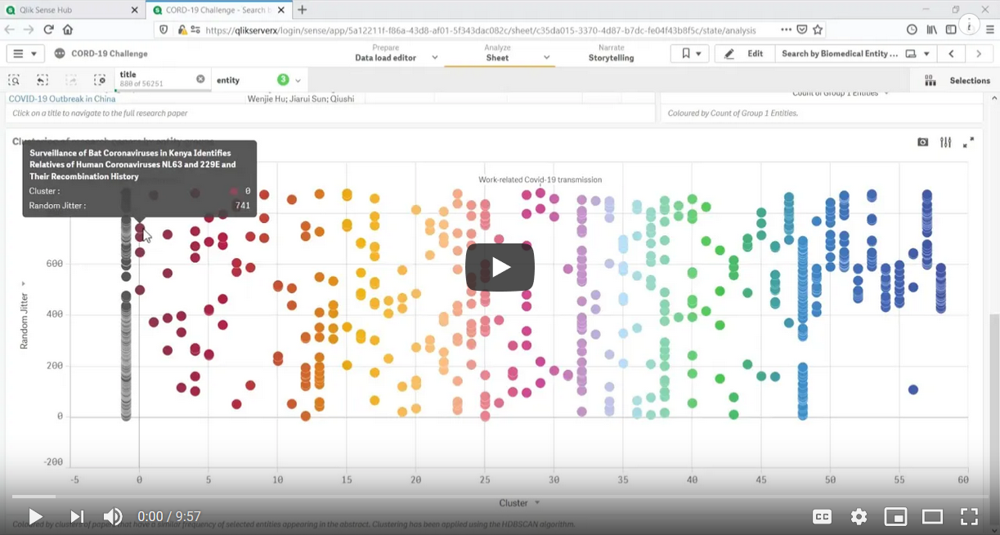

# CORD-19-Qlik
A Qlik solution for the COVID-19 Open Research Dataset Challenge (CORD-19)

## Table of Contents

- [Introduction](#introduction)
    - [Demonstration Video](#demonstration-video)
- [Qlik Sense App](#qlik-sense-app)
- [Approach](#approach)

## Introduction
The [COVID-19 Open Research Dataset (CORD-19)](https://www.semanticscholar.org/cord19) is a growing resource of scientific papers on COVID-19 and related historical coronavirus research. A [Kaggle challenge](https://www.kaggle.com/allen-institute-for-ai/CORD-19-research-challenge) has been issued for this dataset, calling on the AI and Data Science community to develop tools that can help the medical community find answers to high priority scientific questions. 

COVID-19 research is [growing at an incredible rate](https://www.sciencemag.org/news/2020/05/scientists-are-drowning-covid-19-papers-can-new-tools-keep-them-afloat) and machine intelligence could be crucial to help find insights in this repository of data.

This repository provides a Qlik Sense app for the CORD-19 dataset. The app combines the native search, analytics and interactive visualizations of Qlik Sense, with ML capabilities like Named Entity Recognition and Clustering. It also provides an automated load process for keeping the app up to date with new research that is being added to the CORD-19 dataset on a weekly basis.

### Demonstration Video
[](https://youtu.be/5fYWgglx84M)

## Qlik Sense App
The Qlik Sense app can be downloaded [here](https://www.dropbox.com/s/ml8biumnd2b54de/CORD-19-Challenge.qvf?dl=1). It is also available on a public Qlik Sense Entperise site [here](https://pe.qlik.com/sense/app/ef47734d-c668-42a1-ba4d-112432c923c1/sheet/9404c419-ba69-4eff-863c-660ad9eb4726/state/analysis).

A reload of the app requires configuration of the data connections and the QVD files provided [here](data). It also requires the [PyTools Server Side Extension](https://github.com/nabeel-oz/qlik-py-tools). 

The app loads the JSON files for the research papers using Qlik's native REST connector. So a HTTP server hosting these files needs to be prepared and configured in the `Main` section of the app's load script.

## Approach
This solution is aimed at providing search and analytics on the entire CORD-19 dataset. The focus is on ease of finding COVID-19 related research for a given context, which can be based on dimensions such as the paper's title, authors and abstract. 

### Scope
This app does not load the full text of each paper. The decision to restrict the text analysis to abstracts was taken as a practical step to reduce app size, load time and resource requirements. However, the approach used in this app can be applied to the full text with minor updates.

### Loading the JSON files
The JSON files from the CORD-19 dataset were loaded using Qlik's native REST connector which provides capabilities for parsing the JSON and XML documents. However, this connector does not work with local files and requires a REST API to host the source files. 

For this solution, a simple Python HTTP server was setup by executing the following command in the CORD-19 directory.
```
python -m http.server
```

The URL for the server can be provided through the `Main` section in the Qlik Sense app's load script:
```
// URL for HTTP Server hosting the JSON files
// A local HTTP server can be setup by opening a command prompt in a directory and executing the command: python -m http.server
LET vHTTPServer = 'http://localhost:8000/2020-05-22/document_parses/';
```
The directory for the document parses also needs to be specified for the incremental load logic and access to `metadata.csv`. This is controlled by the `vDirectory` variable in the `Main` section:
```
// Directory for the document parses
LET vDirectory = 'lib://Data/CORD-19-research-challenge/2020-05-22';
```

### Incremental Loads
The CORD-19 data is being refreshed daily and research papers may be added or removed. The Qlik Sense app automates the incremental load of data into the app by making use of [QVD files](https://help.qlik.com/en-US/sense/April2020/Subsystems/Hub/Content/Sense_Hub/Scripting/work-with-QVD-files.htm).

The app automatically creates a list of research papers in the `pdf_json` and `pmc_json` subdirectories under the root directory. The root is specified in the `vDirectory` variable mentioned [above](#loading-the-json-files). The latest QVD files are then used to extract a set of previously loaded research papers. With these two lists, we can get a set of new research papers, and previously loaded research papers that need to be retained. During a reload these file lists are written to the `document_parses` directory for reference.

Note that changes to the CORD-19 directory structure or naming conventions would require updates to the app as well. The current version of the app caters for breaking changes introduced on 2020-05-12.

### Named Entity Recognition
The [spaCy](https://spacy.io/) NLP library is used to extract named entities from the titles and abstracts of the research papers. The `en_core_sci_lg` model from [scispaCy](https://allenai.github.io/scispacy/) was selected to perform the Named Entity Recognition (NER) due to its suitability for biomedical data.

The results of the NER are available through the `Biomedical Entity` dimension in the app and can be used to select associated research papers.

### Alternate States
The final sheet of the app provides advanced search capabilities through the use of [Alternate States](https://help.qlik.com/en-US/sense/April2020/Subsystems/Hub/Content/Sense_Hub/Visualizations/alternate-states-comparative-analysis.htm). This allows for ad-hoc grouping of search terms to find relevant research papers. 

### Clustering
This solution uses the [HDBSCAN](https://hdbscan.readthedocs.io/en/latest/) library to cluster research papers within the context of a user's selections. The clusters represent groups of research papers that have a similar frequency of selected biomedical entities in the text (i.e. title and abstract).

The clustering is performed in real-time by the exchange of data between Qlik and Python. This capability requires the [PyTools Server Side Extension](https://github.com/nabeel-oz/qlik-py-tools). 
